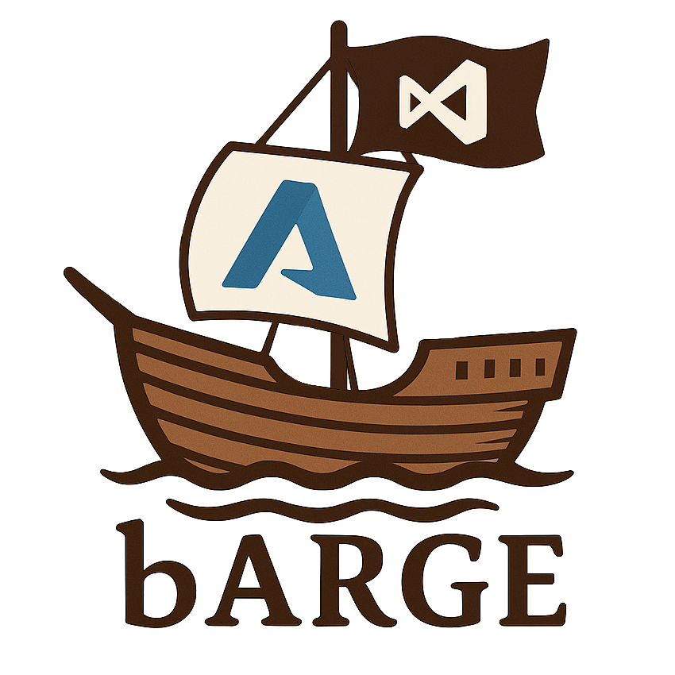
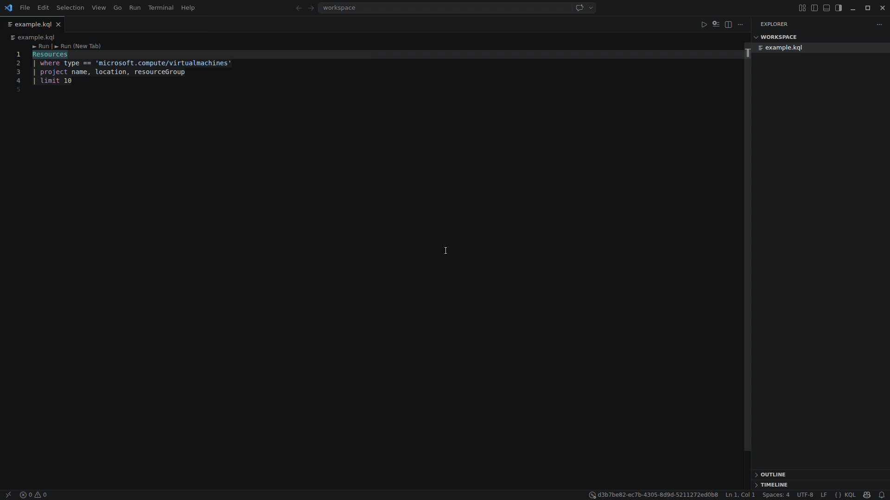
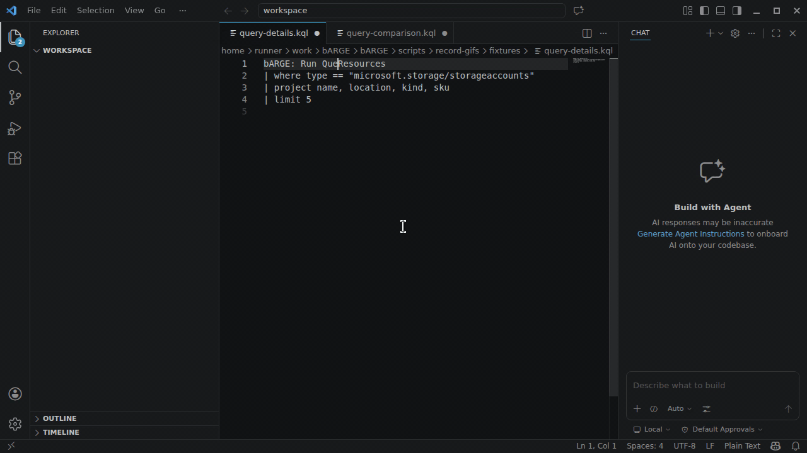
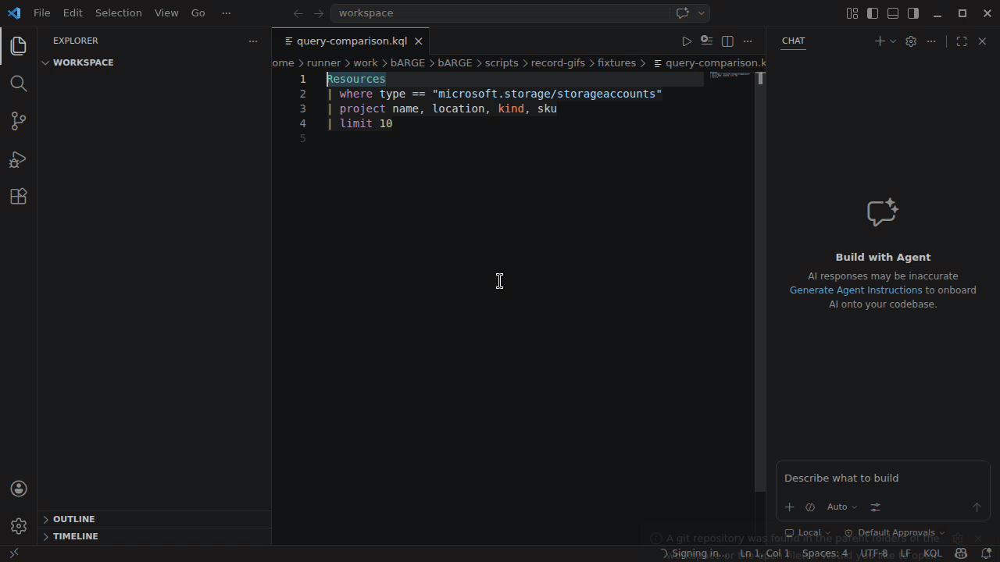
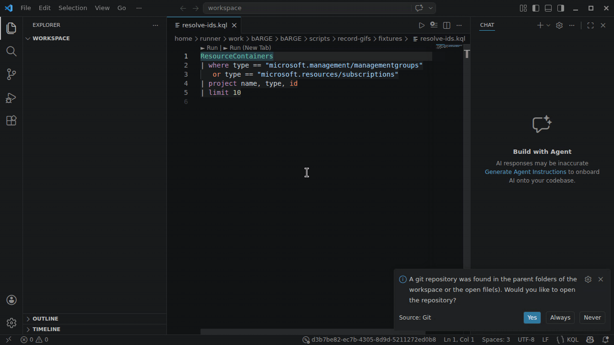

# bARGE - boosted Azure Resource Graph Explorer

[![bARGE]][bARGEMarketplace] [![bARGEDownloads]][bARGEMarketplace]



bARGE is a Visual Studio Code extension that brings Azure Resource Graph querying capabilities with KQL directly to your development environment, similar to the Azure Portal's Resource Graph Explorer. It boosts the functionality with features for better insight such as comparison of results, improved data table handling, easy sign-in and switching of accounts.

## Features

- **Run KQL Queries**: Execute Kusto Query Language (KQL) queries against Azure Resource Graph directly from VS Code.
- **KQL Language Support**: Syntax highlighting, intellisense with completions and hover documentation with context and links.
- **Results Panel**: View query results in a dedicated panel with sortable and resizable columns.
- **Boosted Filtering**: Filter results by column values directly in the table, including sorting, text search and the option to invert all filters.
- **Sticky Filters**: Persist filter selections across queries matched by column name, updating your query shouldn't ruin your insights.
- **Multiple Tabs**: Run multiple queries in parallel and switch between results in different tabs.
- **Resolve Identities against Entra ID**: Resolve GUIDs in query results against Entra ID for more details about identities.
- **Comparison**: Select two or more rows for comparison to see differences in their properties.
- **Copy & Export**: Easily copy selected cells as formatted text or for Excel, or export entire results to CSV for further analysis.
- **Scope Selection**: Choose the subscription or tenant scope for your queries.
- **Authentication Options**: Authenticate using [DefaultAzureCredential](https://learn.microsoft.com/en-us/javascript/api/@azure/identity/defaultazurecredential?view=azure-node-latest&wt.mc_id=DT-MVP-5005372) or VS Code's built-in Microsoft account provider.
- **Adaptive Layout and Theme**: The results panel adapts to your VS Code layout for both vertical and horizontal splits, and respects your theme settings for light and dark mode.

## Installation

1. [Install the extension](https://marketplace.visualstudio.com/items?itemName=PalmEmanuel.barge-vscode) from the VS Code marketplace
2. Search for `bARGE` and install it through the VS Code Extensions menu (CTRL / CMD + SHIFT + X)
3. Run the following command in VS Code's Quick Open panel (CTRL / CMD + P):

```
ext install PalmEmanuel.barge-vscode
```

4. Or [build from source](#building-from-source) for development

## Using bARGE

### Sign In

There are multiple options for sign-in, either via the Azure CLI or via VS Code's logged in Microsoft accounts. The easiest way is to use the `Sign In` command.

The status bar at the bottom of VS Code shows the account currently logged into bARGE, and allows easy switching between accounts.



By default, the extension will attempt to use the available tokens from the [DefaultAzureCredential](https://learn.microsoft.com/en-us/javascript/api/@azure/identity/defaultazurecredential?view=azure-node-latest&wt.mc_id=DT-MVP-5005372) chain, which in order includes:

- Environment Variables
- Workload Identity
- Managed Identity
- Visual Studio Code
- Azure CLI
- Azure PowerShell
- Azure Developer CLI

It's possible to turn off the automatic sign-in through the configuration settings for bARGE.

Running the `Sign In` command, either through the command palette or through the bARGE status bar account selector, allows selecting either the DefaultAzureCredential described above, or any of the signed-in Microsoft accounts in VS Code.

### Running KQL Queries

There are multiple ways to execute KQL queries against Azure Resource Graph using bARGE.

- **In-line**: bARGE will automatically recognize queries in KQL files and display in-line CodeLens buttons to run the query.
- **From a .kql file**: Open the file and right click to run `bARGE: Run Query from Current File` or click `F5`
- **From selected text**: Select KQL text and right click to run `bARGE: Run Selected Query text` or click `F8`

All commands can display results in a new tab to allow running multiple queries in parallel and comparing results.

Query commands are also represented as buttons in the editor title area while in KQL files, and are also possible to execute from the command palette.



### Interacting with Results

bARGE supports functionality expected from modern tables, and from Azure Resource Graph Explorer in the Azure Portal:

- Resize and reorder columns by dragging headers
- Filter values directly per column header like in Excel, with support for sorting and text search
- Select cells and copy data to other tools, with or without headers
- Hover or right click JSON values such as `properties`, to view or copy formatted content
- Export results to CSV for further analysis or reporting
- Select a row in the results table for details
- Select multiple rows in the results table for comparison and quick overview of matching or differing properties



### Resolve Identities

bARGE can resolve GUIDs in query results against Entra ID to find the names and more details about identities, either by individual rows or entire columns.

**NOTE**: This requires read access in Entra ID.



This feature is particularly useful when exporting the results to CSV for reports or further analysis, as it can add context to otherwise cryptic GUIDs.

### Filtering Results

The results table supports Excel-style column filtering. Click the filter icon in column headers to open a dropdown where you can search for values, select or deselect individual items, and sort the column. JSON columns like `properties` are excluded from filtering since their values aren't practical to filter on.

There are also additional features to make filtering easier and more powerful:

- **Sticky Filters**: Filter selections can be saved as sticky filters that stay between queries. Saved filters will apply on the same result columns by name, while filters that don't match the current result columns are still saved in the filter list but are inactive.
- **Filter List**: Active and saved filters show up in a list where you can remove individual filters quickly, or navigate to a column's active filter by clicking it in the list.
- **Invert Filters**: Flips the selected values in all active column filters. Note that this does not necessarily select all unselected values, but rather inverts all current filter selections.
- **Clear Filters**: Removes all active and saved filters.

## Configuration

The extension supports the following configuration options in VS Code settings:

| Setting | Description | Default |
|---|---|---|
| `barge.autoAuthenticate` | Automatically authenticate to Azure using DefaultAzureCredential on extension activation | `true` |
| `barge.hideLoginMessages` | Hide login notifications and messages, except errors | `false` |
| `barge.enableHoverTooltips` | Enable IntelliSense hover tooltips for KQL syntax | `true` |
| `barge.enableCompletions` | Enable IntelliSense completions for KQL syntax | `true` |
| `barge.enableRunQueryCodeLens` | Show **Run Query** buttons above query blocks in KQL files | `true` |
| `barge.queryPageSize` | Number of records to fetch per Azure Resource Graph API call (min: 1, max: 1000). Low values may result in rate limiting. | `1000` |

The default keybindings for executing queries are also possible to change.

## Development

### Building from Source

```bash
git clone https://github.com/PalmEmanuel/bARGE.git
cd bARGE
npm install
```

Press `F5` in VS Code to launch the Extension Development Host and debug the extension.

## Contributing

Contributions are welcome! Please feel free to submit a Pull Request.

If you have a feature request, create an Issue!

## Troubleshooting

If you encounter issues with using the extension, verify that your account has access, that you're logged in to the correct account (as indicated in the status bar in the bottom of VS Code), and that your query is correct.

If the problem persists, please create an Issue and try to describe the unexpected behavior and a way to reproduce it.

## Resources

- [Azure Resource Graph Documentation](https://docs.microsoft.com/en-us/azure/governance/resource-graph?wt.mc_id=DT-MVP-5005372)
- [Azure Resource Graph Sample Queries](https://docs.microsoft.com/en-us/azure/governance/resource-graph/samples/starter?wt.mc_id=DT-MVP-5005372)
- [Azure Resource Graph Query Language](https://learn.microsoft.com/en-us/azure/governance/resource-graph/concepts/query-language?wt.mc_id=DT-MVP-5005372)

<!-- References -->
[bARGEDownloads]: https://img.shields.io/visual-studio-marketplace/i/PalmEmanuel.barge-vscode.svg?label=bARGE%20Installs
[bARGEMarketplace]: https://marketplace.visualstudio.com/items?itemName=PalmEmanuel.barge-vscode
[bARGE]: https://img.shields.io/visual-studio-marketplace/v/PalmEmanuel.barge-vscode.svg?label=bARGE
