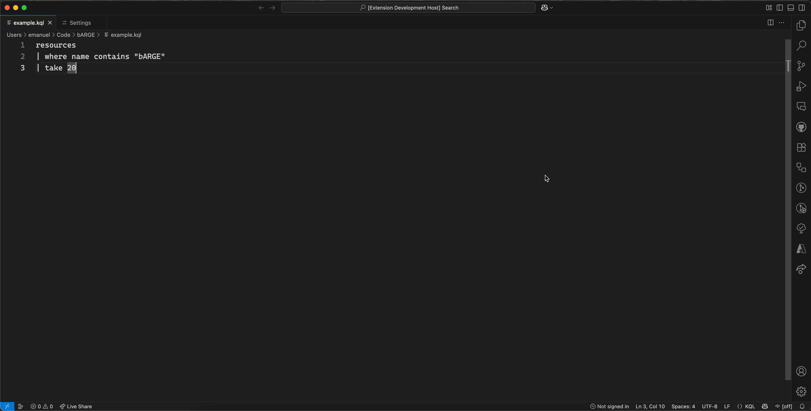

# bARGE - boosted Azure Resource Graph Explorer

[![bARGE]][bARGEMarketplace] [![bARGEDownloads]][bARGEMarketplace]


bARGE is a Visual Studio Code extension that brings Azure Resource Graph querying capabilities with KQL directly to your development environment, similar to the Azure Portal's Resource Graph Explorer. It boosts the functionality with features such as comparison of results, improved data table handling, easy sign-in and switching of accounts.

## Features

- **Run KQL Queries**: Execute Kusto Query Language (KQL) queries against Azure Resource Graph directly from VS Code.
- **Results Panel**: View query results in a dedicated panel with sortable and resizable columns.
- **Comparison**: Select two or more rows for comparison to see differences in their properties.
- **Copy & Export**: Easily copy selected cells as formatted text or for Excel, or export entire results to CSV for further analysis.
- **Scope Selection**: Choose the subscription or tenant scope for your queries.
- **Authentication Options**: Authenticate using [DefaultAzureCredential](https://learn.microsoft.com/en-us/javascript/api/@azure/identity/defaultazurecredential?view=azure-node-latest) or VS Code's built-in Microsoft account provider.

## Installation

1. [Install the extension](https://marketplace.visualstudio.com/items?itemName=PalmEmanuel.barge-vscode) from the VS Code marketplace
2. Run the following command in VS Code's Quick Open panel (CTRL / CMD + P):
```
ext install PalmEmanuel.barge-vscode
```
3. Or [build from source](#building-from-source) for development

## Using bARGE

### Sign In

There are multiple options for sign-in, either via the Azure CLI or via VS Code's logged in Microsoft accounts. The easiest way is to use the Sign In command.



By default, the extension will attempt to use the available tokens from the [DefaultAzureCredential](https://learn.microsoft.com/en-us/javascript/api/@azure/identity/defaultazurecredential?view=azure-node-latest) chain, which in order includes:

- Environment Variables
- Workload Identity
- Managed Identity
- Visual Studio Code
- Azure CLI
- Azure PowerShell
- Azure Developer CLI

It's possible to turn off the automatic sign-in through the configuration settings for bARGE.

Running the Sign In command, through the command palette or through the bARGE status bar account selector, allows selecting either the DefaultAzureCredential described above, or any of the signed-in Microsoft accounts in VS Code.

### Run KQL Queries

   - **From a .kql file**: Open the file and right click to run `bARGE: Run Query from Current File` or press `F5`
   - **From selected text**: Select KQL text and right click to run `bARGE: Run Selected Query text` or press `F8`  
   - **Open the panel**: Run `bARGE: Open bARGE Results Panel` to view previous results

3. **Set your scope** (optional):
   - Run `bARGE: Set Query Scope` to choose subscription or tenant querying scope

4. **Interact with results:**
   - Resize and reorder columns by dragging
   - Select cells and copy data to Excel or other tools
   - Click JSON objects to view formatted content
   - Export results to CSV using the export button in the results panel

## Configuration

The extension supports the following configuration options in VS Code settings:

- `barge.autoAuthenticate`: Automatically authenticate with Azure on extension activation (default: true)

## Commands

- `barge.openResults`: Open bARGE Results Panel
- `barge.runQueryFromFile`: Run Query from Current File (works with .kql files)
- `barge.runQueryFromSelection`: Run Selected Query text
- `barge.setScope`: Set Query Scope (subscription, management group, or tenant)
- `barge.authenticate`: Sign In to Azure

## Keybindings

- `F5`: Run Query from Current File (when editing .kql files)
- `F8`: Run Selected Query (when text is selected in .kql files)

## Development

### Building from Source

```bash
git clone https://github.com/PalmEmanuel/bARGE.git
cd bARGE
npm install
```

Press `F5` in VS Code to launch the Extension Development Host.

## Contributing

Contributions are welcome! Please feel free to submit a Pull Request.

## License

This project is licensed under the MIT License.

## Troubleshooting

### Authentication Issues

If you encounter authentication problems:

1. Make sure you're logged into Azure CLI: `az login`
2. Verify you have access to the subscription you're trying to query
3. Try refreshing your browser authentication

### Query Errors

- Ensure your KQL syntax is correct
- Verify you have permissions to query the resources
- Check that the subscription is selected

### Performance

- Use `limit` clauses for large result sets
- Consider filtering early in your queries to improve performance

## Resources

- [Azure Resource Graph Documentation](https://docs.microsoft.com/en-us/azure/governance/resource-graph/)
- [KQL (Kusto Query Language) Reference](https://docs.microsoft.com/en-us/azure/data-explorer/kusto/query/)
- [Azure Resource Graph Sample Queries](https://docs.microsoft.com/en-us/azure/governance/resource-graph/samples/starter)

<!-- References -->
[bARGEDownloads]: https://img.shields.io/visual-studio-marketplace/d/PalmEmanuel.barge-vscode?label=bARGE%20Downloads
[bARGEMarketplace]: https://marketplace.visualstudio.com/items?itemName=PalmEmanuel.barge-vscode
[bARGE]: https://img.shields.io/visual-studio-marketplace/v/PalmEmanuel.barge-vscode?label=bARGE
